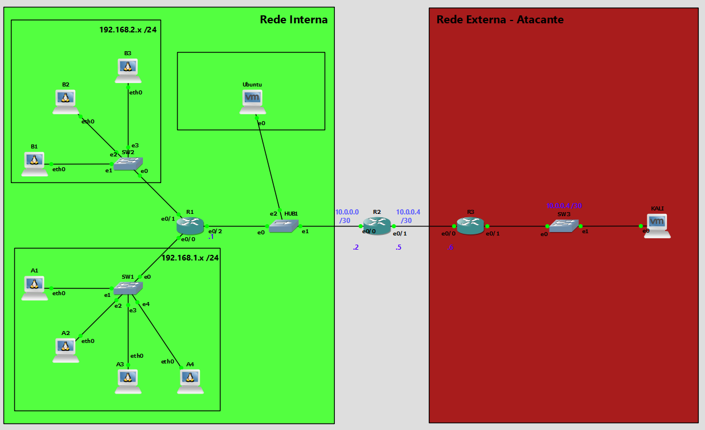

# Análise de Deteção de Ameaças com Suricata (DPI e Lua Scripting)

Este repositório contém os materiais do projeto desenvolvido para a unidade curricular de Segurança no Instituto Superior de Engenharia de Coimbra (ISEC). O foco principal foi criar um ambiente laboratorial para simular ataques de rede e analisar a eficácia do Suricata utilizando Deep Packet Inspection (DPI) e Lua Scripting.

## Objetivo do Projeto

O objetivo deste laboratório foi obter uma compreensão prática do funcionamento do Suricata e expandir as suas capacidades para além das assinaturas estáticas nativas. O projeto focou-se em:
* Implementar uma infraestrutura de rede controlada no GNS3.
* Desenvolver lógicas de deteção com estado (stateful) e inspeção profunda de payloads através da linguagem Lua.
* Simular vetores de ataque focados na Camada 7 (Aplicação).
* Analisar os alertas gerados para tentativas de exfiltração de dados e ferramentas ofensivas.

## Arquitetura da Testbed

A topologia foi emulada no GNS3 e dividida logicamente para isolar o tráfego e simular um ambiente empresarial.

* **Monitorização:** Utilizou-se um Hub Ethernet no backbone da topologia para garantir a replicação física integral de todos os pacotes em trânsito para a interface do IDS.
* **Interface de Captura:** O servidor Suricata necessitou de um endereço IP estático (10.0.0.3/24) na interface de monitorização para permitir que as transações HTTP TCP fossem completadas e analisadas pelo motor DPI.
* **Máquinas:**
  * **Atacante (Rede Externa):** VM Kali Linux para injeção de payloads.
  * **IDS (Core de Inspeção):** VM Ubuntu Server com motor Suricata.
  * **Alvos (Rede Interna):** Simulação de um serviço web na porta 80.

## Simulação de Ataques e Análise

Utilizámos a máquina Kali Linux para executar vetores de ataque específicos, os quais foram intercetados e classificados por quatro scripts Lua desenvolvidos para o projeto.

| Tipo de Ataque | Ferramenta / Script | Alvo | Descrição da Simulação |
| :--- | :--- | :--- | :--- |
| **Exfiltração de Dados (DLP)** | `dlp_cartao.lua` | Servidor Web | Envio de um pedido HTTP POST contendo uma string numérica formatada como um cartão de crédito (1111-2222-3333-4444). |
| **Força Bruta** | `forca_bruta_contador.lua` | Login Web | Múltiplas submissões consecutivas de credenciais inválidas. O contador global stateful disparou o alerta ao exceder 3 tentativas falhadas. |
| **Reconhecimento Web** | `detecao_agente.lua` | Aplicação Web | Injeção de tráfego web com cabeçalhos HTTP User-Agent alterados, utilizando assinaturas de ferramentas como sqlmap, nmap e nikto. |
| **Download de Executáveis** | `bloq_exec.lua` | Rede Interna | Pedidos HTTP GET a recursos com extensões críticas de executáveis (.exe, .sh, .bat). |

## Principais Descobertas

* **Eficácia de Deteção Avançada:** O Suricata provou ser capaz de detetar, pontuar e auditar profundamente os fluxos de rede quando suportado pela agilidade do Lua Scripting, superando firewalls de inspeção de estado tradicionais.
* **Análise de Regras:** Identificámos as assinaturas específicas ativadas nos logs (fast.log) para cada cenário:
  * Fuga de Cartão de Crédito: `sid: 100001`.
  * Força Bruta (3 falhas): `sid: 100002`.
  * Tool de Ataque (User-Agent): `sid: 100003`.
  * Download Executável: `sid: 100004`.
* **Estabilidade do Motor:** Optou-se por utilizar o Suricata versão 6.0.20 em vez da versão mais recente (v8) para garantir compatibilidade e acesso a documentação robusta da API Lua necessária para a implementação célere dos módulos.

## Tecnologias e Ferramentas Utilizadas

* **IDS/IPS:** Suricata v6.0.20
* **Scripting DPI:** Lua v5.1
* **Simulação de Rede:** GNS3
* **Sistemas Operativos:** Ubuntu, Kali Linux
* **Equipamentos de Rede:** Cisco IOU (Routing), Hub Ethernet (Mirroring)

## Conteúdo do Repositório

* **Relatorio.pdf**: O relatório final detalhado cobrindo o enquadramento teórico, arquitetura, desafios de implementação e análise de logs.
* **Apresentacao.pdf**: Os diapositivos de apresentação do projeto com o esquema da topologia e evidências do terminal.

## Autores

* Artur Falcão
* Gabriel Rodrigues
* Rodrigo Prazeres
